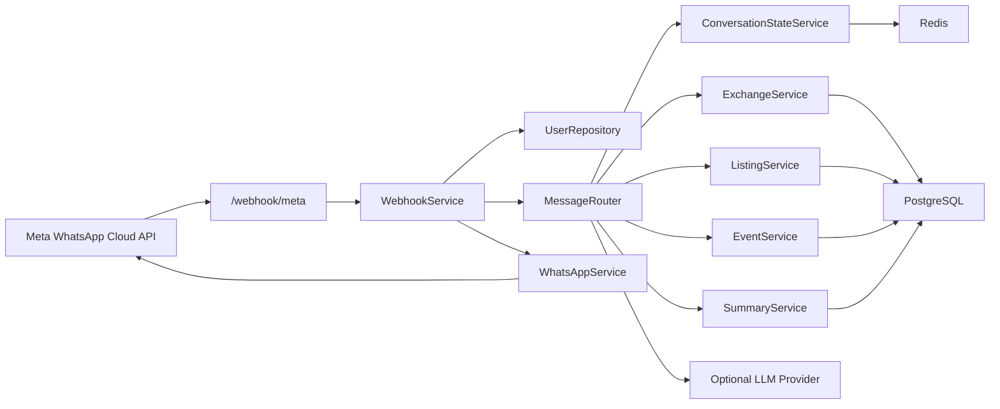
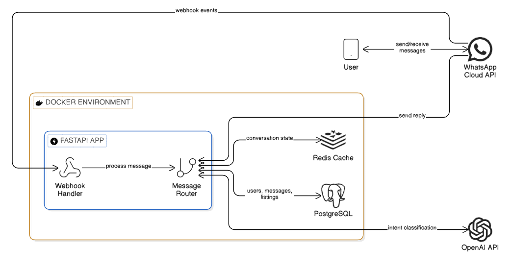

# Architecture

## Goal

Paddington Bot is a backend MVP for a WhatsApp-based community assistant focused on exchange offers, marketplace listings, community events, and short summaries.

## High-level components

- `FastAPI` exposes health checks, CRUD-style API endpoints, and the Meta webhook.
- `WebhookService` normalizes inbound Meta payloads and coordinates message processing.
- `MessageRouter` classifies user intent and drives multi-step conversational flows.
- `Services` implement business logic for exchanges, listings, events, summaries, and conversation state.
- `PostgreSQL` stores durable entities such as users, messages, offers, listings, events, and conversation snapshots.
- `Redis` stores the active short-lived conversation state for faster flow continuation.
- `WhatsAppService` sends outbound messages through the Meta Graph API.
- `LLMProvider` is optional and supplements rule-based extraction and classification.

## Request path



## Runtime boundaries

### API layer

The `app/api/routes/` package exposes REST endpoints and keeps HTTP concerns small. Route handlers mainly:

- validate request inputs via Pydantic schemas
- resolve dependencies through FastAPI
- delegate business work to services
- map domain exceptions into HTTP responses

### Service layer

The `app/services/` package is the center of the application. It contains:

- conversational orchestration
- persistence-oriented business rules
- external provider integration
- summary generation

### Persistence layer

The `app/db/` package is split into:

- `models/` for ORM entities
- `repositories/` for query and persistence helpers
- `session.py` for async engine and session factory

## Operational notes

- The app uses async SQLAlchemy sessions.
- Redis and `httpx.AsyncClient` are created in the FastAPI lifespan handler.
- The LLM is optional by design; rule-based parsing covers core MVP flows.
- Outbound WhatsApp dispatch is attempted even in local development, but falls back to a warning result when Meta credentials are missing.

## Diagram placeholder

Add your general architecture image at:

- `docs/assets/architecture-overview.png`

Then insert this line below if you want the static image shown in GitHub:

```md

```
