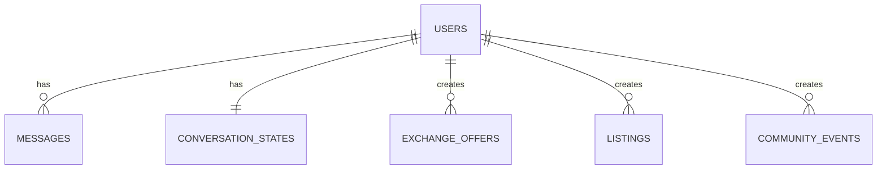

# Database

## Overview

The backend persists durable application state in PostgreSQL through SQLAlchemy 2.0 ORM models.

## Main entities

### `users`

Represents a WhatsApp user known to the system.

Key fields:

- `id`
- `wa_id`
- `wa_profile_name`
- `name`
- `created_at`
- `updated_at`

### `messages`

Stores inbound and outbound messages associated with a user.

Key fields:

- `id`
- `user_id`
- `direction`
- `message_type`
- `text`
- `raw_payload`
- `created_at`

### `conversation_states`

Stores the durable snapshot of a user's current flow. Redis is used for the active copy, but PostgreSQL keeps a mirrored snapshot.

Key fields:

- `user_id`
- `current_flow`
- `current_step`
- `draft_data`
- `updated_at`

### `exchange_offers`

Stores currency exchange offers created by users.

Key fields:

- `user_id`
- `offer_currency`
- `want_currency`
- `amount`
- `location`
- `notes`
- `status`
- `created_at`
- `expires_at`

### `listings`

Stores marketplace posts.

Key fields:

- `user_id`
- `category`
- `title`
- `description`
- `price`
- `currency`
- `location`
- `status`
- `created_at`
- `expires_at`

### `community_events`

Stores community events.

Key fields:

- `user_id`
- `title`
- `description`
- `event_date`
- `location`
- `status`
- `created_at`

## Relationships

## Enums

### `MessageDirection`

- `inbound`
- `outbound`

### `MessageType`

- `text`
- `unsupported`

### `RecordStatus`

- `active`
- `inactive`
- `expired`
- `archived`

### `ListingCategory`

- `item`
- `service`
- `wanted`
- `other`

### `ConversationFlow`

- `idle`
- `exchange_create`
- `exchange_search`
- `listing_create`
- `listing_search`
- `event_create`
- `summary`

## Data lifecycle notes

- `users` are created or updated when inbound webhook messages are processed.
- `messages` keep a raw payload snapshot for audit and debugging.
- `conversation_states` are mirrored in PostgreSQL but cached in Redis for active sessions.
- exchange offers and listings can expire via `expires_at`.
- events are filtered as upcoming based on `event_date`.

## Current caveats

- Message records do not currently persist the external Meta message id as a unique field.
- Conversation state exists in both Redis and PostgreSQL, so consistency rules matter during error handling.
- Expiration is modeled at the record level, but background expiration cleanup is not yet implemented.
