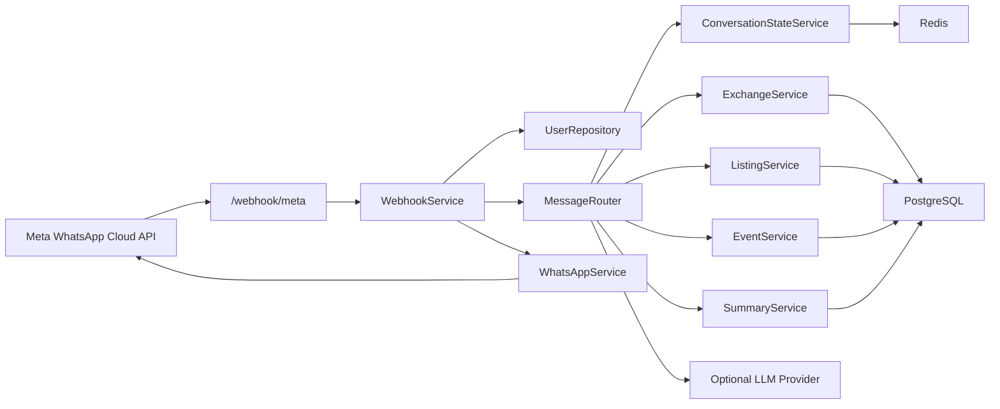

# Architecture

## Goal

Luke-bot is a backend MVP for a WhatsApp-based community assistant focused on exchange offers, marketplace listings, community events, and short summaries.

## Architecture diagram

The static image below is the main system overview for quick reading in GitHub.

The Mermaid diagram below focuses on the runtime interaction between the main backend components.

## Main request flow

The most important production path today is the inbound WhatsApp webhook flow:

1. Meta sends a webhook payload to `POST /webhook/meta`.
2. `WebhookService` extracts supported inbound text messages from the Meta payload.
3. The backend upserts the WhatsApp user and stores the inbound message.
4. `MessageRouter` checks active conversation state and classifies the user intent.
5. Domain services create or query exchange offers, listings, events, or summaries.
6. `WhatsAppService` sends the outbound reply through the Meta Graph API.
7. The outbound message is also stored for audit and debugging purposes.

## High-level components

- `FastAPI` exposes health checks, CRUD-style API endpoints, and the Meta webhook.
- `WebhookService` normalizes inbound Meta payloads and coordinates message processing.
- `MessageRouter` classifies user intent and drives multi-step conversational flows.
- `Services` implement business logic for exchanges, listings, events, summaries, and conversation state.
- `PostgreSQL` stores durable entities such as users, messages, offers, listings, events, and conversation snapshots.
- `Redis` stores the active short-lived conversation state for faster flow continuation.
- `WhatsAppService` sends outbound messages through the Meta Graph API.
- `LLMProvider` is optional and supplements rule-based extraction and classification.

## Runtime boundaries

### API layer

The `app/api/routes/` package handles transport concerns only. Routes validate requests, resolve dependencies, and delegate business work to services.

### Service layer

The `app/services/` package owns the business workflows. This includes webhook orchestration, conversational routing, outbound messaging, record creation, searching, and summary generation.

### Persistence layer

The `app/db/` package owns SQLAlchemy models, repositories, and session setup. PostgreSQL is the source of truth for durable records.

### Cache and state layer

Redis stores active conversation state with TTL-based expiration. PostgreSQL keeps a mirrored conversation snapshot for recovery and inspection.

### Provider layer

External integrations are isolated behind service or provider abstractions:

- Meta WhatsApp Cloud API for inbound and outbound messaging
- optional OpenAI-compatible provider for intent classification and structured extraction

## Operational notes

- The app uses async SQLAlchemy sessions.
- Redis and `httpx.AsyncClient` are created in the FastAPI lifespan handler.
- The LLM is optional by design; rule-based parsing covers core MVP flows.
- Outbound WhatsApp dispatch is attempted even in local development, but falls back to a warning result when Meta credentials are missing.

## Extension points

- Add admin or frontend-facing APIs on top of existing service methods.
- Replace or expand the LLM provider without changing the service contract.
- Introduce background workers for retries, moderation, or cleanup jobs.
- Extend the message router to support richer WhatsApp message types and flows.
- Add authentication and authorization in front of the REST API surface.

## Current limitations

- Webhook processing is still synchronous inside the request path.
- Provider-level idempotency for inbound Meta messages should be strengthened.
- Parser heuristics in `MessageRouter` are intentionally narrow and still need hardening.
- Record expiration exists in the data model, but cleanup and archival automation are not yet implemented.
