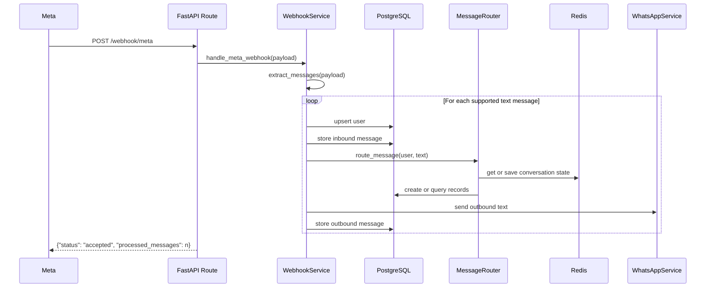

# Webhook Flow

## Goal

This document describes what happens when Meta sends an inbound WhatsApp webhook to the backend.

## Entry points

### `GET /webhook/meta`

Used by Meta for webhook verification.

Inputs:

- `hub.mode`
- `hub.verify_token`
- `hub.challenge`

Behavior:

- validates that mode is `subscribe`
- checks the configured verify token
- returns the challenge string on success

### `POST /webhook/meta`

Used by Meta to deliver inbound message payloads.

Behavior:

1. accepts the raw payload as JSON
2. passes it to `WebhookService.handle_meta_webhook`
3. returns a processing summary

## Processing sequence

## Supported inbound payloads

The current implementation processes:

- text messages only

The current implementation ignores:

- unsupported message types
- empty text bodies
- payloads without sender id

## Message extraction behavior

`WebhookService.extract_messages()` traverses the Meta payload shape:

- `entry[]`
- `changes[]`
- `value.contacts[]`
- `value.messages[]`

For each supported message, it builds a normalized internal object containing:

- WhatsApp sender id
- optional display name
- message text
- timestamp
- raw payload
- provider message id

## Routing behavior

The message router then decides whether the user is trying to:

- create an exchange offer
- search exchange offers
- create a listing
- search listings
- create an event
- request a summary
- request help

If the message is incomplete, the router stores draft state and asks a follow-up question.

## Storage behavior

For each processed inbound text message:

1. the user is upserted
2. the inbound message is stored
3. business logic runs
4. an outbound reply is attempted
5. the outbound message is stored

## Operational caveats

- Processing is synchronous inside the request path.
- There is no background retry queue yet.
- Unsupported messages are ignored instead of being transformed into richer flows.
- The current design should add stronger idempotency around provider message ids before production scale.
